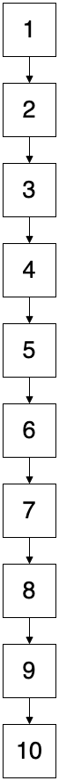

<div class="r-fit-text">
  <h2>
    【MySQL】インデックスを少し理解した
  </h2>
</div>

ひがき

@higaki_program

---

<div class="r-fit-text">
MySQL のインデックスについて勉強したので、

誰かの役に立てばと思いまとめてみる

</div>

<div class="r-fit-text">
感想・誤り等ありましたら、ご連絡いただけます嬉しいです！
</div>

---

## 自己紹介

### 経歴

2020 年 3 月 大学院卒業(愛媛)

2020 年 4 月〜 総合電機メーカーの設計(兵庫)

2022 年 4 月〜 自社開発企業の開発(福岡)

---

### 開発

業務: Laravel + Vue.js

個人開発: Flutter + Firebase 触ってみたり

---

### 趣味

サッカー、バスケ、たまに筋トレ

---

## 対象

- インデックス？？
- 実はよくわかってないんだよね
- 過去・未来の自分

---

## 今回扱う範囲

- MySQL
  - <p style="color:red;">B+Tree</p>
  - R-Tree
  - bitMap
  - hash
  - invertedLists
- PostgreSQL
- SQLServer

<div class="r-fit-text">
  <a href="https://dev.mysql.com/doc/refman/8.0/en/mysql-indexes.html">
  https://dev.mysql.com/doc/refman/8.0/en/mysql-indexes.html
</div>

---

## インデックス とは

> データベースにおけるインデックスとは、目的のレコードを効率よく取得するための「索引」のことです。

<br>
<br>

インデックスとは？仕組みをわかりやすく解説

https://products.sint.co.jp/siob/blog/index

---

### こんなイメージ

インデックスなし



--

例）6 をインデックスなしで検索する


---

インデックスあり


--

例）6 をインデックスありで検索する


---

確かにインデックスを使うと効率良さそう

٩( 'ω' )و

---

### 前提条件

MySQL のデフォルト設定の場合

(innoDB)

---

### インデックスの種類

- クラスタインデックス
- セカンダリインデックス

---

### クラスタインデックス

<div class="r-fit-text">
基本的に PRIMARY KEY に貼られるインデックス

最下層には全カラムの情報がある

MySQL のデフォルト設定では必ず作成される

</div>

--

### 作成の優先順位

1. PRIMARY KEY
2. NOT NULL の UNIQUE インデックス
3. innoDB が自動で作成(表示されない)

<br/>
<br/>

<div class="r-fit-text">

<a href="https://dev.mysql.com/doc/refman/8.0/ja/innodb-index-types.html">
https://dev.mysql.com/doc/refman/8.0/ja/innodb-index-types.html
</a>

</div>

--

### 具体例

User テーブル

<image src="image/table.png" height="500">

--

### クラスタインデックス

最下層に ID, NAME, EMAIL の全ての情報がある

<image src="image/b-tree-cluster.png">

---

### セカンダリインデックス

最下層に

- 指定した KEY
- PRIMARY KEY の情報

を持つインデックス

--

### 生成

- UNIQUE のカラム(MySQL が自動生成)
- 外部キー制約(MySQL が自動生成)
- ユーザーが指定したキーで作成する

```
CREATE INDEX index_user_name ON user(name);
```

--

### 外部キー制約によるインデックス

MySQL では自動で作られる

PostgresSQL では作られない

--

### 具体例

User テーブル

<image src="image/table.png" height="500">

--

NAME にインデックスを貼った場合

```
CREATE INDEX index_user_name ON user(name);
```

<image src="image/b-tree-name.png">

--

ちなみに、インデックスは複数貼ることもできる

```
CREATE INDEX index_user_name ON user(name, email);
```

---

なるほど!!

どのようにインデックスって使われているんや？

(о´∀`о)

---

## インデックスでの検索

User テーブル

<image src="image/table.png" height="500">

---

### メールアドレスが sato@example.com の人物の情報を探せ

```
SELECT * FROM users WHERE email = 'sato@example.com';
```

この場合、どのように検索されるか？

以下のどれか。

- クラスタインデックスでの検索
- NAME のセカンダリインデックスでの検索
- テーブルをフルスキャン(インデックスなしで検索)

--

クラスタインデックスで検索できるか？

<image src="image/b-tree-cluster.png">

ID での検索はできるが

メールアドレスで検索は無理そう

--

NAME のセカンダリインデックスで検索できるか？

<image src="image/b-tree-name.png"  height="400">

NAME での検索はできるが

メールアドレスでの検索は無理そう

--

テーブルをフルスキャン(インデックスなしで検索)

<image src="image/table.png" height="400">

メールアドレスで検索できそう！

<span style="color: red;">これで検索</span>

---

### ユーザー ID が 6 の人物の情報を探せ

```
SELECT * FROM users WHERE id = 6;
```

id が PRIMARY KEY だから

クラスタインデックス使えそう！！

<image src="image/b-tree-cluster-search-user6.png">

必要な情報を GET！

---

### tanaka の人数を数えよ

```
SELECT count(name) FROM users WHERE name = 'tanaka';
```

name だから

NAME のセカンダリインデックスが使えそう

<image src="image/b-tree-name-search.png" height="400">

必要な情報を GET！

---

### MOMOTA のメールアドレスを探せ

```
SELECT name, email FROM users WHERE name = 'momota';
```

<image src="image/b-tree-name-search.png"  height="300">

メールアドレスの情報がない！！

クラスタインデックスには全カラムの情報があるはず

--

### MOMOTA のメールアドレスを探せ

`ID: 8` を使ってクラスタインデックスで検索

<image src="image/b-tree-name-search-cluster.png">

メールアドレスの情報を GET！

---

なるほど、インデックスってこんな感じで使うんや

---

### ちょっと待って Σ੧(❛□❛ )

---

### メールアドレスが sato@example.com の人物の情報を探せ以外

「テーブルをフルスキャン」でもよくないか？

---

### 確かに( ・∇・)

---

誰がインデックスを使うって決めてんの？

---

## オプティマイザー

統計情報を元にデータへのアクセス方法を決定します

---

## テーブルをフルスキャンになる条件

<div class="r-fit-text">

  <ul>
    <li>テーブルがきわめて小さい場合(今回は説明のため小さい)</li>
    <li>参照できるキーがない</li>
    <li>取得するレコード数が多い</li>
    <li>キーの値があまり分散されていない(カーディナリティーが低い)</li>
  </ul>

</div>

<div class="r-fit-text">

<a href="https://dev.mysql.com/doc/refman/8.0/ja/table-scan-avoidance.html">
https://dev.mysql.com/doc/refman/8.0/ja/table-scan-avoidance.html
</a>

</div>

---

## ちなみに

クラスタインデックスを使用しない場合

- SQLServer でクラスタインデックス未作成時
- PostgreSQL (おそらく)

など

<br />

<div class="r-fit-text">

PostgreSQL、Oracle、DB2 がどうなっているかご教授いただけますと嬉しいです(_´∇ ｀_)

</div>

---

### インデックスの構造

実データへの参照先がわかるようになっている

<image src="image/sqlserver-index.png" height="500">

---

### 実データへの参照

<image src="image/sqlserver-table.png" height="500">
